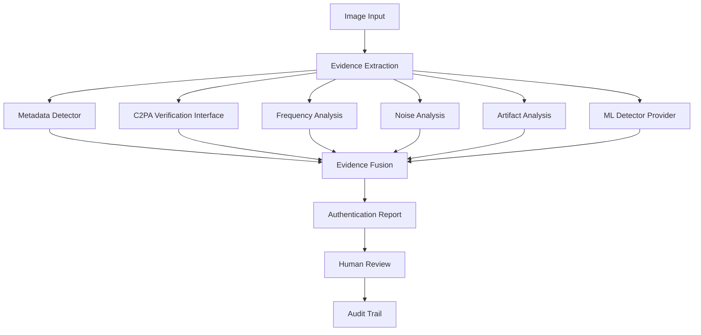
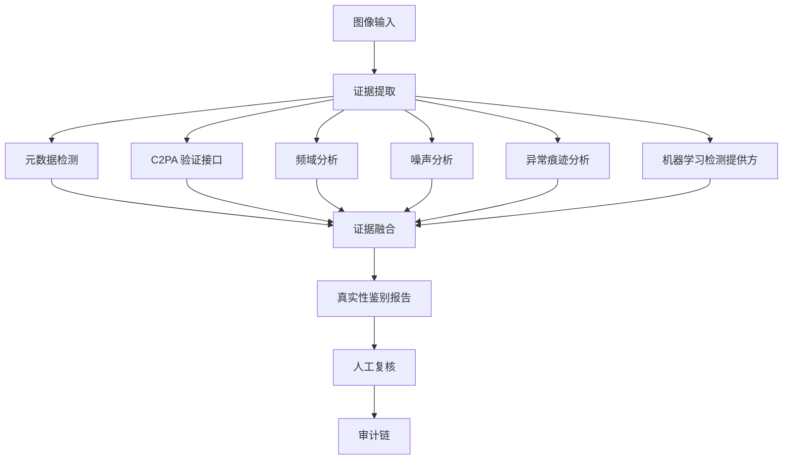

# AI Image Authentication Forensics

## Auditable AI Image Authentication & Digital Forensics Platform


[English](#english) | [简体中文](#简体中文)

---

## English

AI Image Authentication Forensics is an evidence-driven platform for assessing the authenticity of AI-generated and AI-edited images. It is intended for technical evaluation by government, media, enterprise, and research organizations.

Generative AI, AI image editing, and the loss of provenance through online redistribution make authenticity assessment harder than a metadata check, visual inspection, or a single classifier score can address. This project builds an explainable, traceable, reproducible, and auditable assessment workflow.

Rather than returning an isolated "AI probability," the platform assembles an authentication report from image-forensics observations, provenance information, governed model evidence, human review, and an audit trail.

> The platform provides scoped assessments with evidence and limitations. It does not prove an image's origin and does not issue legal or judicial conclusions.

### Design Philosophy

#### Evidence First

Every assessment must be supported by traceable evidence with a source, version, and stated limitation. Evidence may include:

- metadata observations, such as file structure, EXIF, ICC profiles, and editing traces;
- C2PA provenance information and its verification lifecycle;
- pixel-forensics observations, such as frequency, noise, compression, and visual artifacts;
- governed machine-learning evidence, constrained by model, calibration, provider, and validation records.

The absence of EXIF or C2PA information is missing evidence, not evidence that an image was generated by AI.

#### Human in the Loop

The system assists human reviewers; it does not replace them. Review workflows retain reviewer identity, rationale, timestamp, and disagreement records. A system result must not automatically create an operational or judicial decision.

#### Auditability

Input hashes, evidence bundles, model versions, calibration versions, provider admissions, analysis records, report hashes, and audit events are designed to be traceable. An unverified model can be used for research only and cannot contribute to formal report fusion.

#### Uncertainty Awareness

The assessment states are `likely_real`, `likely_ai_generated`, and `uncertain`. Each result includes an evidence summary, validation scope, and limitations. The project does not claim unconditional or absolute AI-image detection.

### System Architecture



Machine-learning scores are supporting evidence, not the sole decision-maker. Before model evidence can appear in a formal report, the Registry of Record must verify the associated model, calibration, and provider-admission records.

### Development Roadmap

| Phase | Scope |
|---|---|
| P0 | Governance foundation, product contracts, and research standards |
| P1 | Deterministic forensic evidence extraction engine |
| P2 | License-aware research baselines and evaluation design |
| P3 | Institutional case, access-control, audit, signing, and private-deployment architecture |
| P4 | Governed detection providers, Registry of Record, and admission chain |
| P5 | Controlled validation and no-consequence shadow-pilot framework |
| P6 | Model-validation framework and first controlled preflight; the current candidate remains experimental after rejection |

These phases represent completed architecture, governance, and research artifacts. They do not indicate institutional production readiness, government recognition, or forensic accreditation.

### Capabilities

| Capability | Status |
|---|---|
| Evidence extraction | Implemented |
| Metadata analysis | Implemented |
| Frequency analysis | Implemented |
| Noise analysis | Implemented |
| Artifact analysis | Implemented |
| C2PA integration design | Implemented |
| Detection-provider framework | Implemented |
| Model registry | Implemented |
| Calibration registry | Implemented |
| Audit trail | Implemented |
| Human-review workflow | Implemented |
| Production detector approval | Research stage |

“Implemented” means that the corresponding architecture, interface, deterministic observation pipeline, or governance artifact exists. It does not indicate general-purpose model-detection capability.

### Governance Architecture

Any detection model proposed for the formal assessment path must pass an auditable governance chain:

```text
Model Registry
      ↓
Calibration Registry
      ↓
Provider Admission
      ↓
Validation Report
      ↓
Formal report evidence (only when every gate is verified)
```

Model records track origin, license, weight hash, evaluation, and limitations. Calibration records define applicable data and excluded conditions. Provider Admission binds the provider, model, calibration, scope, and approval history. An unverified or out-of-scope model can produce experimental output only and cannot affect a formal assessment state.

See the [Registry of Record](docs/p4c/registry-of-record-design.md), [Provider Admission specification](docs/p4c/provider-admission-spec.md), and [model-validation program](docs/p6a/model-validation-program.md) for details.

### Authentication Reports

The platform is report- and evidence-bundle-centered. It can produce:

- a JSON evidence report;
- a PDF authentication report;
- an audit record;
- a hash-bound evidence bundle.

Reports identify the input hash, analysis and tool versions, evidence sources, applicable model, calibration, and provider records, scope and risk state, and limitations. They support human review and do not replace an institution's normal process.

### Validation Status

**Current status: Research / Validation Platform.**

Architecture validation, controlled-validation planning, shadow-pilot design, and a model-validation execution framework are complete. The first P6-B preflight was `REJECTED` because it lacked a signed Registry admission chain, per-file-hash-verifiable data, and sufficient scenario coverage. This is an intentional governance safeguard. See the [P6-B validation report](validation-reports/p6b-efficientnet-p2b2a-preflight-001.md).

The project has not obtained:

- government certification;
- legal digital-forensics accreditation;
- authorization for public or internet-facing deployment.

### Technology

| Area | Design |
|---|---|
| Backend | Python |
| Architecture | Provider-based detection framework |
| Security | Role-based access control, hash verification, audit chain, and evidence preservation |
| Machine learning | Vision-encoder-compatible architecture with calibration and scope controls |
| Deployment | Private-deployment foundation; no public service exposure by default |

For operational boundaries, see the [private-deployment guide](docs/p3c/private-deployment-guide.md), [security baseline](docs/p3c/security-baseline.md), and [operations manual](docs/p3c/operations-manual.md).

### Why This Project?

A typical AI detector follows a narrow path:

```text
Image → single model score or probability
```

This project follows an evidence-driven path:

```text
Image → evidence collection → governed fusion → audit-ready report → human review
```

The design places model output within verifiable evidence and explicit limitations. It allows an institution to assess why a result was produced, when it applies, and how it can be reviewed later, rather than treating a single score as a conclusion.

### Roadmap

- **P6-C — Red-team robustness and re-validation preparation:** complete license, per-file-hash, cross-source, and transformation coverage before a new independent controlled validation;
- **Future — Institutional shadow pilot:** run a private, parallel, no-consequence pilot only when P5/P6 admission conditions are met and a separate institutional authorization is granted;
- **Future — Governance maturity:** continue work on C2PA verification, model calibration, failure-case retention, reproducibility exercises, and internal audit processes.

### Limitations

AI-image authentication is probabilistic, scope-limited, and requires continuous validation. The platform does not:

- claim absolute or unconditional AI-image detection;
- claim to prove an image's unique or absolute origin;
- issue automatic judicial conclusions;
- replace human review or formal governance with an unvalidated model.

Any use should account for data origin, license, image transformations, validation scope, failure cases, and the relevant institutional process.

### Historical Prototype

The repository originally explored image reconstruction and prompt-oriented experimentation. That prototype remains separate from the authentication workflow and is not evidence for authenticity assessment, generator attribution, or model-origin claims.

---

## 简体中文

AI 图像真实性鉴别与数字取证平台，是一个以证据为中心的系统，用于评估 AI 生成或 AI 编辑图像的真实性。项目面向政府、媒体、企业与研究机构的技术评估场景。

生成式 AI、AI 图像编辑以及网络传播导致的来源信息缺失，使得仅靠元数据检查、人工观察或单一分类器分数，难以完成可靠的真实性评估。本项目构建可解释、可追踪、可复现、可审计的鉴别工作流。

系统不会孤立地输出“AI 概率”，而是将图像取证观察、内容来源信息、受治理的模型证据、人工复核与审计链整合为鉴别报告。

> 系统输出带有适用范围、证据和限制的真实性评估；它不能证明图像的绝对来源，也不构成法律或司法结论。

### 设计原则

#### 证据优先

每项评估都必须由可追踪的证据支撑，并注明来源、版本和限制。证据可以包括：

- 文件结构、EXIF、ICC 配置文件和编辑痕迹等元数据观察；
- C2PA 内容来源信息及其验证生命周期；
- 频域、噪声、压缩和视觉异常等像素取证观察；
- 受模型、校准、提供方和验证记录约束的机器学习辅助证据。

缺少 EXIF 或 C2PA 信息只表示证据缺失，不能据此认定图像由 AI 生成。

#### 人工复核

系统用于辅助人工审核，而不是取代人工。复核流程保留审核人员、理由、时间和分歧记录。系统结果不得自动形成业务决定或司法决定。

#### 可审计性

输入文件哈希、证据包、模型版本、校准版本、提供方准入记录、分析记录、报告哈希与审计事件均按照可追溯原则设计。未经验证的模型只能用于研究，不能参与正式报告的证据融合。

#### 不确定性意识

真实性评估状态包括 `likely_real`、`likely_ai_generated` 和 `uncertain`。每项结果都应附带证据摘要、验证范围和限制说明。项目不宣称无条件或绝对的 AI 图像检测能力。

### 系统架构



机器学习分数只是辅助证据，不是唯一裁决。模型证据进入正式报告前，记录库必须验证对应的模型、校准和提供方准入记录。

### 开发路线

| 阶段 | 范围 |
|---|---|
| P0 | 治理基础、产品契约与科研规范 |
| P1 | 确定性图像取证证据提取引擎 |
| P2 | 受许可证约束的研究基线与评估设计 |
| P3 | 机构级案件、权限、审计、签名与私有化部署架构 |
| P4 | 受治理的检测提供方、正式记录库与准入链 |
| P5 | 受控验证和无业务后果的影子试点框架 |
| P6 | 模型验证框架与首次受控预检；当前候选因不满足准入条件仍处于实验状态 |

上述阶段表示架构、治理和研究工件已经完成，不代表系统已具备机构正式运行条件、获得政府认可或取得法定数字取证资质。

### 核心能力

| 能力 | 状态 |
|---|---|
| 证据提取 | 已实现 |
| 元数据分析 | 已实现 |
| 频域分析 | 已实现 |
| 噪声分析 | 已实现 |
| 异常痕迹分析 | 已实现 |
| C2PA 集成设计 | 已实现 |
| 检测提供方框架 | 已实现 |
| 模型记录库 | 已实现 |
| 校准记录库 | 已实现 |
| 审计链 | 已实现 |
| 人工复核工作流 | 已实现 |
| 生产检测模型准入 | 研究阶段 |

“已实现”表示相应的架构、接口、确定性观察管线或治理工件已经建立；不表示任何模型具有普遍适用的检测能力。

### 治理架构

任何拟进入正式鉴别流程的检测模型，均须通过下列可审计治理链：

```text
模型记录库
   ↓
校准记录库
   ↓
提供方准入
   ↓
验证报告
   ↓
正式报告证据（仅在所有关口均已验证时）
```

模型记录保存来源、许可证、权重哈希、评估与限制；校准记录定义适用数据和排除条件；提供方准入将提供方、模型、校准、适用范围和审批历史绑定。未经验证或超出验证范围的模型，只能产生实验性输出，不能影响正式鉴别状态。

详细说明见[正式记录库设计](docs/p4c/registry-of-record-design.md)、[提供方准入规范](docs/p4c/provider-admission-spec.md)和[模型验证方案](docs/p6a/model-validation-program.md)。

### 鉴别报告

系统以报告和证据包为核心，可生成：

- JSON 格式的证据报告；
- PDF 格式的真实性鉴别报告；
- 审计记录；
- 与哈希绑定的证据包。

报告列明输入文件哈希、分析与工具版本、证据来源、适用的模型、校准和提供方记录、范围与风险状态以及限制说明。报告支持人工复核，不替代机构既有流程。

### 验证状态

**当前状态：研究与验证平台。**

项目已完成架构验证、受控验证规划、影子试点设计和模型验证运行框架。首次 P6-B 预检因缺少已签名的记录库准入链、可按文件哈希验证的数据以及足够的场景覆盖，被判定为 `REJECTED`。这是治理机制有意设置的阻断措施。详情见 [P6-B 验证报告](validation-reports/p6b-efficientnet-p2b2a-preflight-001.md)。

项目尚未取得：

- 政府认证；
- 法定数字取证资质；
- 面向公众或公网部署的授权。

### 技术设计

| 范畴 | 设计 |
|---|---|
| 后端 | Python |
| 架构 | 基于提供方的检测框架 |
| 安全 | 基于角色的访问控制、哈希验证、审计链与证据保全 |
| 机器学习 | 兼容视觉编码器的架构，并受校准与适用范围控制 |
| 部署 | 私有化部署基础；默认不暴露公网服务 |

运行边界详见[私有化部署指南](docs/p3c/private-deployment-guide.md)、[安全基线](docs/p3c/security-baseline.md)和[运维手册](docs/p3c/operations-manual.md)。

### 为什么采用这种方式？

常见的 AI 图像检测器通常只有一条简单路径：

```text
图像 → 单一模型分数或概率
```

本项目采用以证据为中心的路径：

```text
图像 → 证据收集 → 受治理的融合 → 可审计报告 → 人工复核
```

这种设计把模型输出置于可验证证据和明确限制之中，使机构能够审查结果为何产生、适用于哪些条件以及日后如何复核，而不是把单一分数视为结论。

### 后续路线

- **P6-C：红队鲁棒性与再次验证准备。** 在完成许可证、逐文件哈希、跨来源与跨变换覆盖后，开展新的独立受控验证；
- **未来：机构影子试点。** 仅在满足 P5/P6 准入条件并获得单独机构授权后，开展私有、并行、无业务后果的影子试点；
- **未来：治理成熟度建设。** 持续完善 C2PA 验证、模型校准、失败案例留存、复现演练和机构内部审计流程。

### 限制说明

AI 图像真实性鉴别是一项概率性、范围受限且需要持续验证的技术。系统不会：

- 宣称绝对或无条件的 AI 图像检测能力；
- 宣称能够证明图像唯一或绝对的来源；
- 自动输出司法结论；
- 使用未经验证的模型取代人工复核或正式治理流程。

任何使用都应审慎考虑数据来源、许可证、图像变换、验证范围、失败案例和具体机构流程。

### 历史原型说明

该仓库早期曾探索图像重建和面向提示词的实验功能。这些历史原型与真实性鉴别工作流保持隔离，不能作为真实性评估、生成器归因或模型来源判断的证据。
