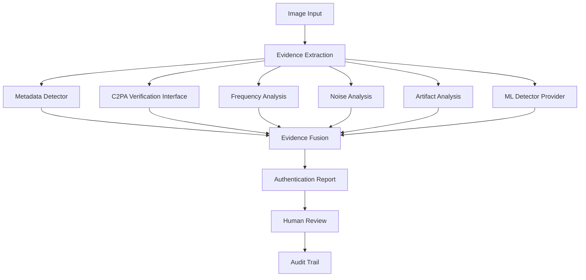

# AI Photo Reconstructor

## Auditable AI Image Authentication & Digital Forensics Platform


面向政府、媒体、企业和研究机构的 **AI 生成图像真实性鉴别与可审计数字取证系统**。项目定位为 Evidence-driven AI Image Authentication System：它不是一个只输出概率的普通 AI 检测器，而是将来源信息、图像取证信号、受治理的模型证据、人工复核与审计记录连接为可解释、可追踪、可复现的鉴别链路。

> 系统输出的是有范围、有证据和有限制说明的真实性评估，不是图像来源的绝对证明，也不是司法结论。

## 项目简介

随着生成式 AI 快速发展，AI 生成图片、AI 编辑图片以及图片传播链污染问题正在影响媒体、企业、研究机构和公共治理场景。传统的 EXIF 检查、人工观察或单一分类器，无法单独满足机构对真实性验证、复核和责任追踪的需求。

本项目建立一个以证据为中心的 AI 图片鉴别体系：

- 可解释：每项观察都有来源、方法版本和限制说明；
- 可追踪：输入 hash、模型/校准版本、Provider 准入与报告引用可以关联；
- 可复现：Evidence Bundle、分析参数和输出 hash 支持受控复核；
- 可审计：案件、报告、审批和审计链的设计支持机构内部治理。

提示词重建功能仍与取证能力严格隔离；它不是本项目的鉴别结论、模型归因或真实性判断依据。

## Design Philosophy

### Evidence First

系统不直接给出不可解释的结论。真实性评估只能建立在有边界的证据之上，包括：

- metadata evidence（文件结构、EXIF、ICC 与编辑痕迹）；
- C2PA provenance（内容凭证读取及其验证架构）；
- pixel forensic signals（频域、噪声、压缩和视觉异常观察）；
- ML evidence（受模型、校准和 Provider 治理约束的辅助证据）。

缺少 EXIF 或 C2PA 是证据缺失，不是 AI 生成的证据。

### Human-in-the-loop

系统辅助分析，人工负责最终复核。报告、验证和影子试点流程均保留人工审核、理由、时间和分歧记录；系统结果不能自动形成业务或司法决定。

### Auditability

输入文件 hash、Evidence Bundle、模型版本、校准版本、Provider 准入、分析过程、报告 hash 和审计事件均采用可追溯的记录边界。未经验证的模型只能用于实验，不能进入正式报告证据融合。

### Uncertainty-aware

真实性评估状态为 `likely_real`、`likely_ai_generated` 或 `uncertain`，并附证据摘要、验证范围和限制。系统不宣称对 AI 图像进行绝对或无条件判断。

## System Architecture



ML Provider 的分数是辅助证据，而不是唯一裁决。进入正式报告前，模型证据需通过 Registry of Record 的模型、校准和 Provider 绑定验证。

## Development Roadmap

### Completed

| Phase | Scope |
|---|---|
| P0 | Governance foundation、产品契约与科研规范 |
| P1 | 可运行的确定性取证证据引擎 |
| P2 | 受许可约束的研究基线与评估设计 |
| P3 | 机构级案件、权限、审计、签名与私有化架构 |
| P4 | 受治理 Detection Provider、Registry of Record 与准入链 |
| P5 | 受控验证与无业务后果的 Shadow Pilot 框架 |
| P6 | 模型验证框架与首次受控预检；当前候选被拒绝，仍为 experimental |

这些阶段表示架构、治理与研究工件的完成状态，不表示可进入机构正式运行、获得政府认可或具备法定取证资格。

## 核心能力

| Capability | Status |
|---|---|
| Evidence extraction | Done |
| Metadata analysis | Done |
| Frequency analysis | Done |
| Noise analysis | Done |
| Artifact analysis | Done |
| C2PA integration design | Done |
| Detection Provider framework | Done |
| Model Registry | Done |
| Calibration Registry | Done |
| Audit Trail | Done |
| Human Review Workflow | Done |
| Production detector approval | Research stage |

“Done” 表示相应架构、接口、确定性观察管线或治理工件已经建立；不表示任何模型具备普遍检测能力。

## Governance Architecture

每个准备进入正式鉴别流程的检测模型必须形成可审计的治理链：

```text
Model Registry
      ↓
Calibration Registry
      ↓
Provider Admission
      ↓
Validation Report
      ↓
Formal report evidence (only when every gate is verified)
```

模型记录需要可追溯的来源、许可、权重 hash、评估和限制；校准记录限定适用数据与排除条件；Provider Admission 将 Provider、模型、校准、scope 和审批链绑定。任何未经验证或超范围的模型只能产生实验性结果，不能影响正式鉴别状态。

有关该链路的细节见 [Registry of Record](docs/p4c/registry-of-record-design.md)、[Provider Admission](docs/p4c/provider-admission-spec.md) 与 [模型验证方案](docs/p6a/model-validation-program.md)。

## Authentication Report

系统的鉴别输出以报告和证据包为中心，可生成：

- JSON evidence report；
- PDF authentication report；
- audit record；
- hash-bound Evidence Bundle。

报告包含输入 hash、分析与工具版本、证据来源、适用的模型/校准/Provider 信息、风险与范围状态，以及限制说明。它支持人工复核，不自动替代机构正常流程。

## Validation Status

当前项目是 **Research / Validation Platform**。

已完成架构验证、受控验证方案、影子试点设计和模型验证运行框架。首次 P6-B 预检因缺少签名 Registry 准入链、逐文件 hash 可验证数据和足够场景覆盖而得到 `REJECTED`；这正是治理机制应有的阻断行为。详见 [P6-B 验证报告](validation-reports/p6b-efficientnet-p2b2a-preflight-001.md)。

项目尚未取得：

- 面向政府的认证；
- 法定数字取证资质；
- 公网或面向公众的部署授权。

## 技术栈

| Area | Design |
|---|---|
| Backend | Python |
| Architecture | Provider-based detection framework |
| Security | RBAC、hash verification、audit chain、evidence preservation |
| ML | Vision-encoder-compatible architecture；模型证据受校准和范围约束 |
| Deployment | Private deployment foundation；不默认暴露公网服务 |

工程与部署边界见 [私有化部署文档](docs/p3c/private-deployment-guide.md)、[安全基线](docs/p3c/security-baseline.md) 和 [运行手册](docs/p3c/operations-manual.md)。

## Why this project?

普通 AI detector 往往遵循：

```text
图片 → 单一模型分数或概率
```

本项目采用：

```text
图片 → 证据收集 → 可信融合 → 审计报告 → 人工复核
```

这种设计将模型输出置于可验证证据和明确限制之中，支持机构评估“为什么得到这个结果、它适用于什么范围、未来如何复核”，而非把单一模型分数当作结论。

## Roadmap

- **P6-C — Red-team robustness and re-validation preparation：** 补齐许可、逐文件 hash、跨来源与跨变换覆盖后，开展新的独立受控验证；
- **Future — Institutional shadow pilot：** 仅在 P5/P6 准入条件满足且获得单独机构授权后，开展私有、并行、无业务后果的影子试点；
- **Future — governance maturity：** 持续完善 C2PA 验证、模型校准、失败案例库、复现演练和机构内部审计流程。

## Limitations

AI 图片鉴别是概率性、范围受限且需要持续验证的技术。系统不会：

- 宣称绝对或无条件的 AI 图像检测能力；
- 宣称能够证明某张图片的唯一或绝对来源；
- 输出自动司法结论；
- 以未验证模型替代人工复核或正式治理流程。

任何使用都应结合数据来源、许可证、图像变换、验证范围、失败案例和具体机构流程进行审慎评估。

## Engineering Assurance

持续集成覆盖 Python 3.11/3.12 测试、依赖一致性检查、编译检查与 Docker 镜像构建。供应链工作流执行已知漏洞扫描并产出可归档的 CycloneDX SBOM；边界说明见 [供应链文档](docs/supply-chain.md)。这些工程控制不构成认证或合规承诺。
