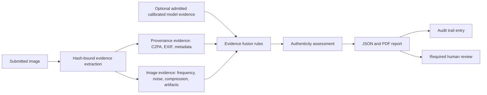

# P2-C AI Image Authentication Report Engine

## Scope and boundary

P2-C produces an auditable assessment package for human review. It does not replace the existing creative reconstruction route, does not expose prompt reconstruction in an authentication report, and does not identify a specific image generator as a product outcome.

## Evidence fusion design

The fusion layer is deterministic, versioned, and conservative.

| Evidence family | Accepted input | Fusion role | Prohibited inference |
| --- | --- | --- | --- |
| Provenance | C2PA/metadata observations and verifier state | Describes present source claims and validation state | Missing C2PA/EXIF is not AI evidence. |
| Image observations | Frequency, residual noise, compression and artifact observations | Reviewer context and completeness | A visual anomaly is not proof of AI generation. |
| Model evidence | Versioned score, declared population scope, calibration state and limitation | Auxiliary only, only when calibrated and in scope | Model output cannot be the sole judicial or origin determination. |

Current rule set `p2c.authentication.1` returns `uncertain` in every runnable P2-C case: the model-admission registry is intentionally empty and the current C2PA reader is marker-only. P3 may enable `likely_ai_generated` only for a registry-admitted calibrated model, a score at or above 0.90, validated provenance evidence, and named corroborating observations. `likely_real` additionally requires a score at or below 0.10 and cryptographically validated C2PA. Both remain moderate-confidence review states, not facts. Thresholds are report rules, not deployment thresholds.

## Authentication report format

The engine writes `authentication-report.json`, `authentication-report.pdf`, the P1 evidence directory, and `audit-trail.jsonl`.

The P2-C JSONL audit log is a local append log for testing and review, not an immutable custody system; the P3 external audit sink is mandatory before institutional reliance.

| Required field | Purpose |
| --- | --- |
| `input_sha256`, `analysis_time_utc`, `tool_versions` | Reproduce the exact input and method. |
| `assessment` | `likely_real`, `likely_ai_generated`, or `uncertain`, with confidence, evidence summary and limitations. |
| `evidence` | Provenance, image observations, optional model evidence, evidence completeness and explainability score. |
| `risk_level` | Review-priority signal only; not legal severity. |
| `audit_trail` | Submitter ID, timestamps, tool version, input hash and output hash. |
| `output_sha256` | Hash of the canonical report payload, excluding the self-referential hash fields. |

Evaluation of this engine prioritises false-positive rate, false-negative rate, evidence completeness, explainability score, and report reproducibility. Evidence completeness is the fraction of metadata, validated provenance, image observations, and admitted calibrated model evidence that are actually present; explainability is the fraction of included observations that carry source, method version, and limitation and are listed in the fusion trace. Classification accuracy is supplementary and must remain population-scoped.

## P3 institution deployment route

1. Obtain legal, records-management and data-governance approval for report retention, submitter identity, access and redaction.
2. Replace local JSONL audit persistence with an institution-controlled immutable audit sink and signed report storage; validate retention and retrieval drills.
3. Admit independently evaluated, calibrated model evidence only after source-disjoint validation, false-positive review, model card approval and change control.
4. Integrate C2PA verification with a maintained verifier and trusted-claim policy; distinguish signer trust from image truth.
5. Run role-based pilot review with documented appeal/escalation, periodic reproducibility checks, and no automated adverse or judicial action.
