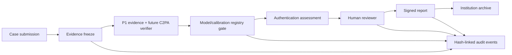

# P3-A Institutional Architecture

Compatibility: P0 contracts retain uncertainty and human review; P1 observations map to `EvidenceProvenance`; P2 experiments remain research records and are not automatically admitted models; P2-C reports retain `likely_real|likely_ai_generated|uncertain` but P3-A admits no new status-producing model.

## P3-B implementation plan

1. Implement registry persistence and signed governance workflow without altering detection models.
2. Add a maintained C2PA verifier adapter and trust-policy test corpus.
3. Implement case storage, role-separated review, report signing and immutable audit sink integration.
4. Run security, retention, reproducibility and false-positive governance exercises before any institutional pilot.
