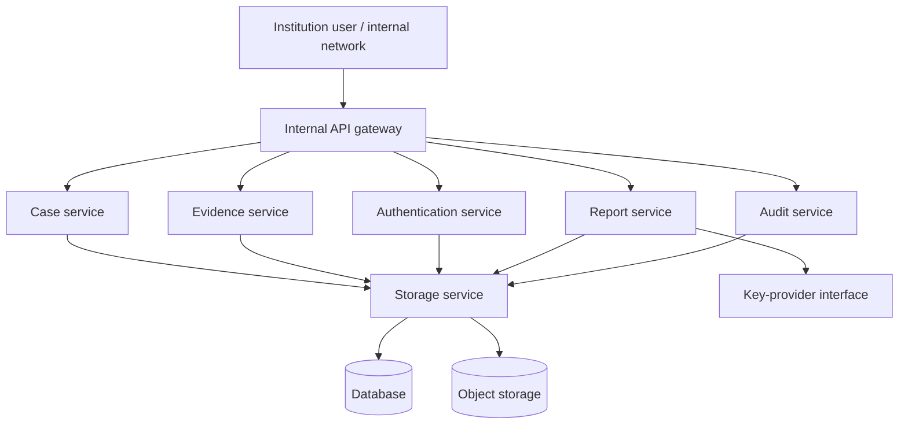

# P3-C private deployment guide

## Scope and boundary

This is a reference deployment for a local, institution-operated acceptance environment. It is not a public service, production accreditation, government-system integration, or a claim that an assessment establishes image origin. The existing Authentication Engine and its conservative evidence rules are unchanged.



The Compose reference keeps database and object storage on the `institution_internal` network. Only the backend has a host mapping, and it is constrained to `127.0.0.1:8080`; a reverse proxy inside an approved institution network is a later operational decision.

## Local acceptance startup

1. Copy `config/private.env.example` to a protected local file outside source control, replace every placeholder, and set file ACLs for the deployment operator only.
2. Confirm that the configuration is complete. The application requires `DATABASE_URL`, `STORAGE_PATH`, `SIGNING_KEY_PROVIDER`, `AUDIT_CONFIG`, and `LOG_LEVEL`.
3. Render the deployment plan without starting it:

   ```powershell
   docker compose --env-file C:\secure\private.env config
   ```

4. Start the isolated local environment:

   ```powershell
   docker compose --env-file C:\secure\private.env up --build
   ```

5. Use only `http://127.0.0.1:8080` from the host. Do not add a `0.0.0.0` port binding or publish the database or storage ports.

The supplied Compose services are an implementation scaffold: current application persistence remains governed by the repository-port design below. Institution deployment requires a reviewed database adapter, storage adapter, gateway, identity provider, key-provider implementation, and change-control approval before operational use.

`tests/test_docker_startup.py` is an opt-in acceptance test. On a dedicated Docker-capable test host, set `RUN_DOCKER_STARTUP_TEST=1` and run it with the project test command. It starts a uniquely named, loopback-only Compose project with disposable test credentials and removes only that project's containers and volumes afterwards.

## Deployment separation

| Component | P3-C reference responsibility | Boundary |
| --- | --- | --- |
| Backend | Existing internal API and analysis components | No authenticity logic changes |
| Database | Postgres service for the target topology | No host port; adapter selection pending institution review |
| Object storage | MinIO-compatible local object-store topology | No host port; no real credentials in source |
| Key provider | Test HMAC or injected external-KMS adapter | No real KMS binding or institution key |
| Logs and health | Internal operational signals only | Must not export submitted image bytes |
