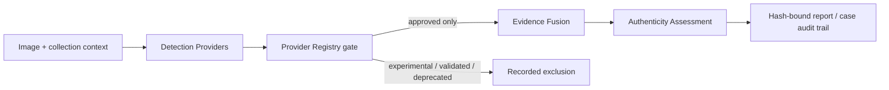

# P4-A Detection Provider Architecture

P4-A adds a governed evidence-ingress layer between image-analysis components and the existing Authentication Engine. It does not train a model, call an external service, or let any provider issue an authenticity conclusion.

Every provider output is `DetectionEvidence`, bound to the submitted image's SHA-256 through `EvidenceProvenance`. The collection gate verifies the provider's ID and version against its registry entry. An unregistered provider is rejected. A registered provider that is not `approved` is not executed for a formal report and its exclusion is recorded.

P1 metadata, C2PA-marker, and frequency/noise/artifact observations are supplied as optional built-in adapters. They preserve their original P1 limitations. The C2PA adapter maps an absent marker only to `NOT_PRESENT` and all marker-only cases to `UNKNOWN`; it does not claim `VALID` or `INVALID` because cryptographic verification is not implemented.
